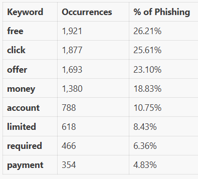
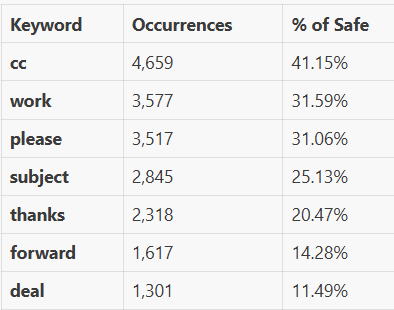

**Dataset 1**

**1. Basic Info**
- Total Emails: 18,650
- Safe Emails: 11,322 (60.71%)
- Phishing Emails: 7,328 (39.29%)

**2. Dataset Structure**
- Two columns: Email Text and Email Type
- Well-labeled binary classification dataset (Safe vs Phishing)
- Contains 16 null values in Email Text; 1,112 duplicate emails

**3. Email Content Length**
- Average length: 2,755 characters (535 words)
- Safe emails are significantly longer: 3,493 chars (686 words) on average
- Phishing emails are shorter: 1,614 chars (302 words) on average
- Email length ranges from 1 to 17M+ characters (likely contains some encoding issues)

**4. URL/Link Patterns**
- 37.5% of all emails contain URLs
- Safe emails: 39.6% with URLs
- Phishing emails: 34.3% with URLs
- Shows that phishing isn't always URL-heavy

**5. Top Phishing Keywords**

**6. Safe Email Characteristics**

**7. Suspicious Patterns**
- *Repeated punctuation (!!, ??, etc.)*: 431 phishing vs 205 safe emails (68% are phishing)
- *Dollar amounts ($)*: 593 phishing vs 255 safe emails (70% are phishing)
- *Urgent language (urgent, immediate, now)*: 3,027 phishing vs 4,610 safe emails

**8. Contact Information**
- 2,653 emails (14.2%) contain email addresses
- 623 emails (3.3%) contain phone numbers
- More prevalent in phishing (contact info to trap users)

**9. Data Quality Issues**
- 16 null/empty email texts
- 1,112 duplicate emails (5.96% duplication rate)
- Some extremely long entries (17M+ chars) suggest data encoding or formatting issues
- Dataset appears to be sourced from multiple domains (Enron emails mixed with generic phishing templates)

**10. Dataset Composition**
The dataset appears to contain:

- Enron corporate emails (basis for "safe" examples)
- Generic phishing templates (spam, scams, financial fraud)
- Spamassassin spam collection data
- Various attack vectors: Nigerian prince scams, romance scams, job offers, mortgage refinancing, product sales, adult content, etc.
